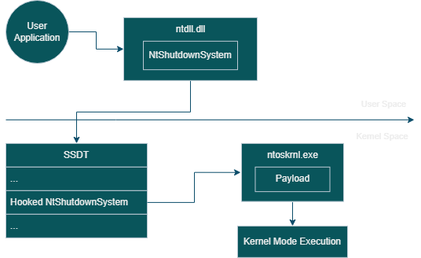

<p align="center">
    
    <h3 align="center">Insomnia</h3>
    <p align="center">Bootkit that infects the kernel via SSDT hooking</p>
</p>

### General
- Uses UEFI TSL phase for infecting kernel
- Bypasses Kernel Patch Guard (KPP) by hooking SSDT pre-initialization
- Tiny binary only 3 KB in size

## Features

- Makes SSDT hook by modifying `KiServiceTable` to redirect syscalls before kernel initialization.
- Injects payload into unused `PAGE` section padding to evade `.text` disk-memory comparisons.
- Retrieves usermode arguments via usermode stack `GS:[UserRSP]` from `_KPCR`.
- Executes kernel functions from usermode via hooked `NtShutdownSystem` syscall.

## Workflow


#### UefiMain
- Hooks `ExitBootServices` to intercept boot process exit.

#### ExitBootServicesHook
1. Calls `BlpArchSwitchContext` to access virtual memory.
2. Scans `OslLoaderBlock` to find `ntoskrnl.exe` base address.
3. Injects payload into `PAGE` section padding.
4. **SSDT Manipulation**: 
   - Resolves `KiServiceTable` via manual kernel traversal.
   - Overwrites `NtShutdownSystem` entry to point to the payload.
5. Restores original `ExitBootServices` hook and firmware context.

#### Payload Execution
- Retrieves usermode arguments via usermode stack `GS:[UserRSP]` from `_KPCR`.
- Can execute any kernel function (e.g. `MmCopyVirtualMemory`).
- Preserves original `NtShutdownSystem` functionality to avoid suspicion.


Full explanation on how it works u can find [here](https://3a1.github.io/posts/insomnia-bootkit/).

## Usermode Usage
```asm
    Bootkit bootkit;
    uint64_t current_process = bootkit.call("PsGetCurrentProcess");
```

## Compatibility
- Tested on **Windows 10 22H2**. 
- Patterns can require updates for other OS versions.

## Credits
- Inspired by ekknod [SubGetVariable](https://github.com/ekknod/SubGetVariable) project.
